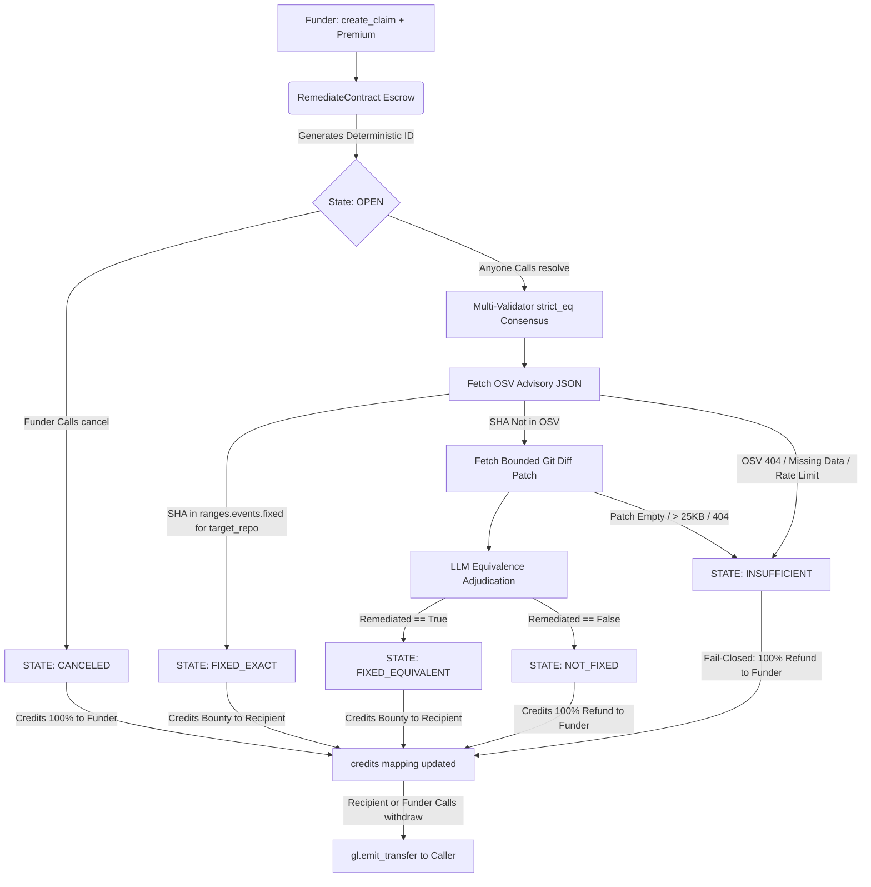

# 🛡️ Remediate

**Fail-Closed Vulnerability Escrow Primitive on GenLayer**

Remediate is a deterministic, fail-closed vulnerability fix escrow protocol built on GenLayer StudioNet. It replaces open-ended, subjective AI jury courts with strict cryptographic commit verification and multi-validator intelligent consensus.

Funders lock native GEN against a specific repository and vulnerability advisory. When a patch is submitted, validators strictly verify whether the commit SHA is recorded in the Open Source Vulnerabilities (OSV) database as an authentic `fixed` event for that exact repository. If and only if the exact commit is not yet cataloged, validators evaluate the `.patch` diff against the advisory using bounded, prompt-injection-defended LLM consensus.

---

### 🌐 Live Protocol Info
- **Live App:** [https://remediate-five.vercel.app/](https://remediate-five.vercel.app/)
- **StudioNet Contract Address:** `0xc95dad8863829185CD8bfFe62c25D005c4F8Ea07`
- **Chain ID:** `61999`
- **RPC Endpoint:** `https://studio.genlayer.com/api`

---

## 🏗️ Architecture & State Machine

Remediate enforces an unbreachable **fail-closed state machine** where native GEN cannot be trapped or lost.




## ⚡ Live StudioNet Settlement Proofs

Real transactions finalized on GenLayer StudioNet demonstrating the fail-closed state machine:

| Resolution Path | Target | Transaction Hash | Result |
| :--- | :--- | :--- | :--- |
| **FIXED_EXACT** | `curl/curl` (`OSV-2017-1`) | `0x05b485473a9d8e365f68a4b1e97bb566cd0294d48fd4be369cc7033bb744aa57` | Recipient paid `0.02 GEN`. Exact commit verified in OSV `fixed` events. |
| **INSUFFICIENT** | Missing Advisory (404) | `0x6cfe87b8ab53ec0c06219bd7ed049c2f1a17e53ab56330cebece766cf4402df4` | Funder refunded `0.01 GEN`. Failed fetch safely failed closed. |
| **CANCELED & WITHDRAWN**| Open Escrow Hatch | `0xc48b2bfc6922b0d24c4e65fab2a36f585cd89f6f34594f5fa4bab78f84293c1f` | Funder canceled and withdrew `0.05 GEN` with zero remaining balance. |

*Full evidence receipts and parameters are cataloged in [`evidence/studionet.json`](evidence/studionet.json).*

---

## 🧪 Testing

### 1. Unit Tests (Pure Logic & Parsing)
Run the offline pytest suite to verify deterministic parsing and fail-closed rules:
```bash
pytest tests/unit/test_logic.py -v
```

### 2. Direct GenLayer Tests
Run direct-mode simulation tests with concurrent execution:
```bash
pytest tests/direct/test_remediate.py -v
```

---

## 💻 Local Frontend Setup

1. **Install Dependencies**
   ```bash
   cd frontend
   npm install
   ```

2. **Run Development Server**
   ```bash
   npm run dev
   ```

3. **Build for Production**
   ```bash
   npm run build
   ```
