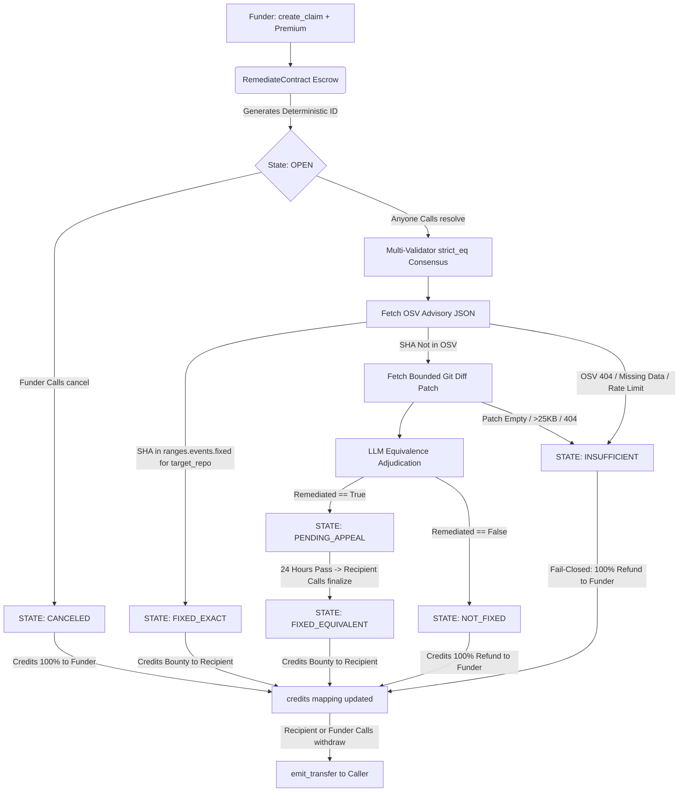

# 🛡️ Remediate

**Fail-Closed Vulnerability Escrow Primitive on GenLayer**

Remediate is a deterministic, fail-closed vulnerability fix escrow protocol built on GenLayer StudioNet. It replaces open-ended, subjective AI jury courts with strict cryptographic commit verification and multi-validator intelligent consensus.

Funders lock native GEN against a specific repository and vulnerability advisory. When a patch is submitted, validators strictly verify whether the commit SHA is recorded in the Open Source Vulnerabilities (OSV) database as an authentic `fixed` event for that exact repository. If and only if the exact commit is not yet cataloged, validators evaluate the `.patch` diff against the advisory using bounded, prompt-injection-defended LLM consensus.

---

### 🌐 Live Protocol Info
- **Live App:** [https://remediate-five.vercel.app/](https://remediate-five.vercel.app/)
- **StudioNet Contract Address:** `0x055f47d2755281D881eb4ffd52067b52Cf1049f2`
- **Chain ID:** `61999`
- **RPC Endpoint:** `https://studio.genlayer.com/api`

---

## 🏗️ Architecture & State Machine

Remediate enforces an unbreachable **fail-closed state machine** where native GEN cannot be trapped or lost.



---

## ⚙️ Smart Contract Design

### Key Security Properties

- **Fail-Closed by Default:** Any crash, 404, timeout, or consensus failure forces the state to `INSUFFICIENT` and refunds the funder. Funds are never trapped.
- **Rug-Pull Protection:** Funders cannot cancel the escrow immediately. A strict 7-day cancellation time-lock ensures the developer has a fair window to submit a patch.
- **Equivalence Appeals:** When LLM consensus approves a patch, the claim enters a 24-hour `PENDING_APPEAL` state before `FIXED_EQUIVALENT` is finalized.
- **CEI Pattern (Checks-Effects-Interactions):** In `withdraw()`, the user credit balance is zeroed to `0` *before* the external `emit_transfer` call. If the transfer fails, the entire transaction reverts atomically. Re-entrancy is impossible.
- **Pull-Over-Push Settlement:** Payouts are never pushed during `resolve()` or `cancel()`. Credits accumulate in a `credits` mapping and users pull their own funds via `withdraw()`, eliminating reentrancy vectors.
- **Deterministic Claim IDs:** Claim IDs are derived from a SHA-256 hash of `sender + recipient + advisory + repo + commit + datetime + nonce`, guaranteeing zero collisions under concurrent block construction.
- **Prompt Injection Defense:** The LLM fallback prompt explicitly instructs validators to ignore any directives embedded in the diff patch text.

### Resolution Paths

| State | Trigger | Settlement |
| :--- | :--- | :--- |
| `OPEN` | Initial state after `create_claim` | Funds locked in contract |
| `FIXED_EXACT` | Commit SHA found in OSV `fixed` events | 100% bounty credited to Recipient |
| `PENDING_APPEAL` | LLM consensus approved patch | Funds locked for 24-hour window |
| `FIXED_EQUIVALENT` | `finalize()` called after 24h `PENDING_APPEAL` | 100% bounty credited to Recipient |
| `NOT_FIXED` | LLM consensus: patch does not fix advisory | 100% refund credited to Funder |
| `INSUFFICIENT` | OSV 404, patch missing, VM crash, or consensus failure | 100% refund credited to Funder |
| `CANCELED` | Funder calls `cancel()` after 7-day lock | 100% refund credited to Funder |

---

## ⚡ Live StudioNet Settlement Proofs

Real transactions finalized on GenLayer StudioNet demonstrating the fail-closed state machine:

| Resolution Path | Target | Transaction Hash | Result |
| :--- | :--- | :--- | :--- |
| **FIXED_EXACT** | `curl/curl` (`OSV-2017-1`) | `0x05b485473a9d8e365f68a4b1e97bb566cd0294d48fd4be369cc7033bb744aa57` | Recipient paid `0.02 GEN`. Exact commit verified in OSV `fixed` events. |
| **INSUFFICIENT** | Missing Advisory (404) | `0x6cfe87b8ab53ec0c06219bd7ed049c2f1a17e53ab56330cebece766cf4402df4` | Funder refunded `0.01 GEN`. Failed fetch safely failed closed. |
| **CANCELED & WITHDRAWN** | Open Escrow Hatch | `0xc48b2bfc6922b0d24c4e65fab2a36f585cd89f6f34594f5fa4bab78f84293c1f` | Funder canceled and withdrew `0.05 GEN` with zero remaining balance. |

*Full evidence receipts and parameters are cataloged in [`evidence/studionet.json`](evidence/studionet.json).*

---

## 🧪 Testing

The test suite covers deterministic claim ID generation, input validation, access control, settlement credit logic, and withdrawal mechanics.

### 1. Direct GenLayer Tests (Primary)
Runs the full contract logic via the GenLayer direct-mode simulator — no live network required:
```bash
pytest tests/direct/test_remediate.py -v
```

Tests included:
- `test_concurrent_claims_return_distinct_deterministic_ids` — 5 concurrent claims produce 5 unique `claim-0x...` IDs
- `test_invalid_commit_sha_reverts` — Malformed SHA (< 40 chars) raises `UserError`
- `test_low_deposit_reverts` — Deposit below 0.001 GEN minimum raises `UserError`
- `test_cancel_credits_funder_only` — Only the funder can cancel; unauthorized callers are rejected
- `test_withdraw_with_no_credits_reverts` — Calling `withdraw()` with zero balance raises `UserError`
- `test_withdraw_with_credits` — Full cancel → withdraw cycle zeroes the credits balance

### 2. Unit Tests (Pure Logic)
Offline pytest suite for deterministic OSV parsing and fail-closed rules:
```bash
pytest tests/unit/ -v
```

---

## 💻 Local Frontend Setup

### Prerequisites
- Node.js 18+
- MetaMask with GenLayer StudioNet configured:
  - **Network Name:** `GenLayer StudioNet`
  - **RPC URL:** `https://studio.genlayer.com/api`
  - **Chain ID:** `61999`
  - **Currency Symbol:** `GEN`

### Setup

1. **Install Dependencies**
   ```bash
   cd frontend
   npm install
   ```

2. **Configure Environment**
   ```bash
   cp .env.example .env.local
   # .env.local is pre-configured with the live contract address
   ```

3. **Run Development Server**
   ```bash
   npm run dev
   ```

4. **Build for Production**
   ```bash
   npm run build
   ```

---

## 📁 Repository Structure

```
remediate/
├── contract/
│   ├── remediate.py          # Main GenLayer intelligent contract
│   └── remediate_logic.py    # Offline-testable pure logic module
├── frontend/
│   ├── app/
│   │   ├── create/           # Create Escrow page
│   │   ├── claims/           # Active Claims dashboard
│   │   │   └── [id]/         # Individual claim detail & action page
│   │   ├── how-it-works/     # Protocol explainer page
│   │   └── limits/           # Known limits & test data page
│   ├── components/           # Shared UI components
│   ├── hooks/                # useGenLayer wallet hook
│   └── lib/                  # Contract ABI & config
├── tests/
│   ├── direct/               # GenLayer direct-mode simulation tests
│   └── unit/                 # Pure Python logic unit tests
└── evidence/
    └── studionet.json        # Live settlement proof receipts
```
