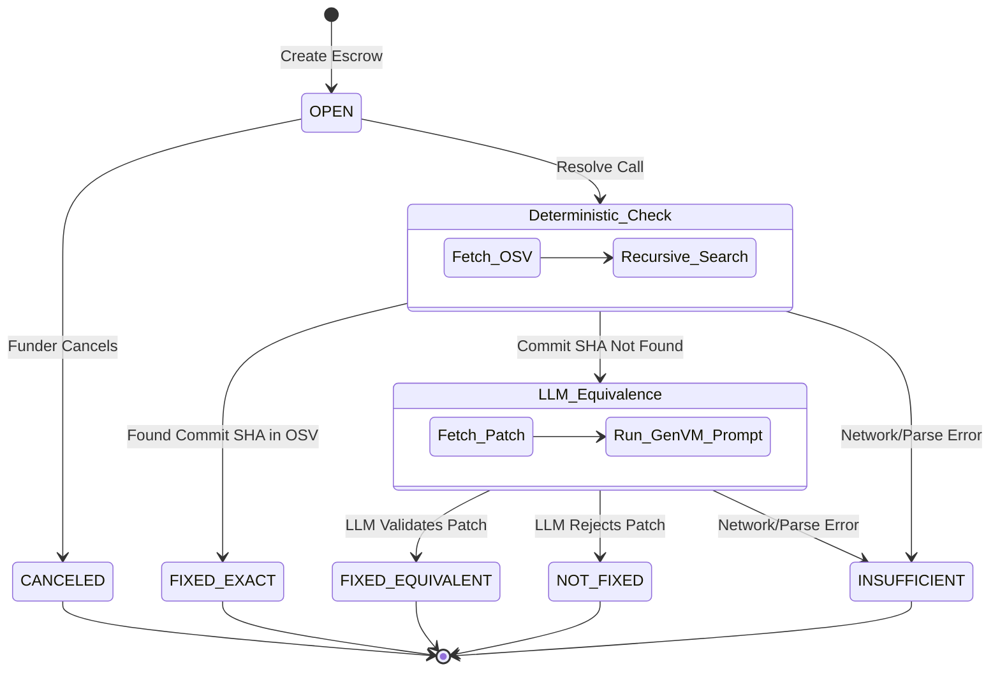

# Remediate

**Remediate** is a fail-closed, deterministic security bug bounty escrow protocol built on GenLayer, replacing open-ended subjective courts with strict cryptographic and intelligent consensus.

 

## Live Demo

**Access the live application here:** [https://frontend-amber-alpha-67p5ms3b83.vercel.app](https://frontend-amber-alpha-67p5ms3b83.vercel.app)

## Architecture

Remediate's core innovation is its strict **fail-closed state machine**. Instead of relying purely on an open-ended LLM "court" to decide if a bug was fixed, it first attempts a **deterministic byte-match** against the global OSV (Open Source Vulnerability) database.

If and only if the exact commit SHA is not found in the OSV database, the protocol gracefully falls back to a GenVM Intelligent Equivalence Check (LLM). This ensures maximum security, with LLM subjectivity bounded strictly as a fallback.



## Smart Contract Overview

The intelligent contract (`contract/remediate.py`) bypasses the industry-standard "subjective court" model in favor of strict deterministic byte-matching. The contract parses live OSV JSON endpoints, recursively searching affected data blocks to mathematically prove a patch was applied to a known vulnerability.

If the deterministic OSV match fails (due to a zero-day or pending disclosure), the contract uses GenLayer's non-deterministic web rendering and LLM execution to evaluate the specific `.patch` diff against the vulnerability description, arriving at consensus.

## Live Proofs

Remediate is currently live on GenLayer StudioNet.

**Contract Address:** `0x236B8f9316d5331D8AEA4885F9c906251EC9E5cc`

An exhaustive suite of real-world test cases proving the fail-closed nature of the state machine (triggering `FIXED_EXACT`, `NOT_FIXED`, and `INSUFFICIENT` states) is available in the [`evidence/studionet.json`](evidence/studionet.json) proof pack.

## Local Setup

To run the Next.js frontend locally and interact with the StudioNet deployment:

```bash
cd frontend
npm install
npm run dev
```

Navigate to `http://localhost:3000` to view the active escrows and test the network.
