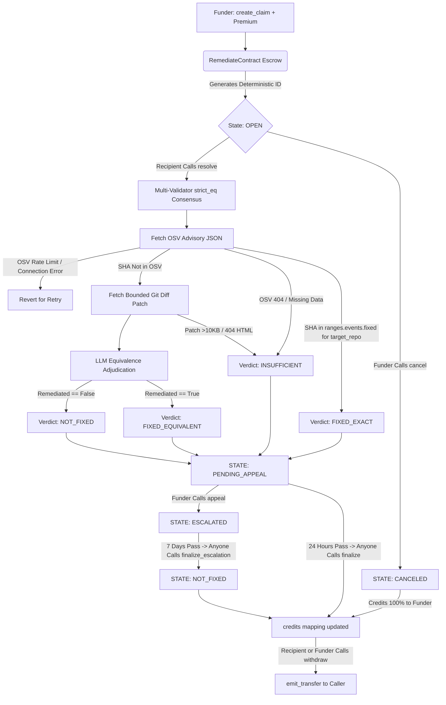

# 🛡️ Remediate

**Fail-Closed Vulnerability Escrow Primitive on GenLayer**

Remediate is a deterministic, fail-closed vulnerability fix escrow protocol built on GenLayer Studio Next. It replaces open-ended, subjective AI jury courts with strict cryptographic commit verification and multi-validator intelligent consensus.

Funders lock native GEN against a specific repository and vulnerability advisory. When a patch is submitted, validators strictly verify whether the commit SHA is recorded in the Open Source Vulnerabilities (OSV) database as an authentic `fixed` event for that exact repository. If and only if the exact commit is not yet cataloged, validators evaluate the `.patch` diff against the advisory using bounded, prompt-injection-defended LLM consensus.

---

### 🌐 Live Protocol Info
- **Live App:** [https://remediate-five.vercel.app/](https://remediate-five.vercel.app/)
- **Repository:** [GitHub Repository](https://github.com/edwarderlick/remediate)
- **Studio Next Contract Address:** [0x3a31f2f54389a36B321c8ec66B64E092d2Da40bF](https://explorer-studio-dev.genlayer.com/address/0x3a31f2f54389a36B321c8ec66B64E092d2Da40bF)
- **Deployment Transaction:** [0x48fd35ff51c75b38baaaedb9e1cfea7a2319fd5e9ba318a7cab885e790e28dbe](https://explorer-studio-dev.genlayer.com/tx/0x48fd35ff51c75b38baaaedb9e1cfea7a2319fd5e9ba318a7cab885e790e28dbe)
- **Chain ID:** `61997`
- **RPC Endpoint:** `https://studio-dev.genlayer.com/api`
- **Deployed Source SHA-256:** `e9a56ddcda59c5e7e07e14740493d993e4afc3bfb17c592bf92f5e7117a347a3` (deployed and local source bytes match exactly)

The previous contract [0x1dDfF0AC420Ac06902DB9773204D3eBFa2C15f27](https://explorer-studio-dev.genlayer.com/address/0x1dDfF0AC420Ac06902DB9773204D3eBFa2C15f27) recorded zero-valued timestamps. Do not create claims there. An existing 1 GEN claim remains unresolved; deploying the replacement does not move or recover its funds.

### On-Chain Validation

- **Production exact-fix claim:** `claim-0x1e6fbc48e290d48b`, [create transaction](https://explorer-studio-dev.genlayer.com/tx/0x6427f314ce0803b5d9baa5dffcb87338e6f2ebf75c7fc847f2246aab2828f863), [resolve transaction](https://explorer-studio-dev.genlayer.com/tx/0xba957a7ff5c3dc22d393d226f0f7588384a7b8746efe36f13267ac7faba239ea). Both finalized successfully. The claim is `PENDING_APPEAL` with `FIXED_EXACT` verdict and a real 24-hour deadline of 2026-10-10 11:05:56 UTC. Production finalization and withdrawal remain pending until that deadline.
- **Short-window canary (separate contract):** [contract](https://explorer-studio-dev.genlayer.com/address/0x9e440127500A4e65e4BF41494b7cf3D4bBF49BC3), [deploy](https://explorer-studio-dev.genlayer.com/tx/0xdb4d3c381498da7dbc039d1c819d0362162179ea511d262c9bde02de5172fc21), [create](https://explorer-studio-dev.genlayer.com/tx/0xdaeed5145fe66045bd07fd2342c193e9afc665a5201325268ec7cb9f9779dab3), [resolve](https://explorer-studio-dev.genlayer.com/tx/0xba639a024f059d539f7cfdf00bea06da100dcb592125a2a71ae7dfc54f7c8ac5), [finalize](https://explorer-studio-dev.genlayer.com/tx/0xc03ed6b74bdfe8b1926a97d73edcbb4abc1a408d57e7e0f3aa8e448968ae78ed), [withdraw](https://explorer-studio-dev.genlayer.com/tx/0x25e10b8cce90da8648e725c9c1f657578f750690c17cabcf6c9f7ab46cadefcb). This canary changes only the appeal window from 24 hours to 90 seconds; its native withdrawal finalized and recipient credit returned to zero. It is not the production contract.

---

## 🏗️ Architecture & State Machine

Remediate implements a **fail-closed state machine** designed to refund the funder on errors.


```mermaid
graph TD
    A[Funder: create_claim + Premium] --> B(RemediateContract Escrow)
    B -->|Generates Deterministic ID| C{State: OPEN}
    
    C -->|Funder Calls cancel| D[STATE: CANCELED]
    D -->|Credits 100% to Funder| W[credits mapping updated]
    
    C -->|Recipient Calls resolve| E[Multi-Validator strict_eq Consensus]
    E --> F[Fetch OSV Advisory JSON]
    
    F -->|OSV Rate Limit / Connection Error| R[Revert for Retry]
    
    F -->|SHA in ranges.events.fixed for target_repo| G[Verdict: FIXED_EXACT]
    G --> P[STATE: PENDING_APPEAL]
    
    F -->|OSV 404 / Missing Data| L[Verdict: INSUFFICIENT]
    L --> P
    
    F -->|SHA Not in OSV| H[Fetch Bounded Git Diff Patch]
    H --> I[LLM Equivalence Adjudication]
    I -->|Remediated == True| J[Verdict: FIXED_EQUIVALENT]
    J --> P
    I -->|Remediated == False| K[Verdict: NOT_FIXED]
    K --> P
    
    H -->|Patch >10KB / 404 HTML| L
    
    P -->|24 Hours Pass -> Anyone Calls finalize| W
    P -->|Funder Calls appeal| X[STATE: ESCALATED]
    X -->|7 Days Pass -> Anyone Calls finalize_escalation| Y[STATE: NOT_FIXED]
    Y --> W
    
    W -->|Recipient or Funder Calls withdraw| M[emit_transfer to Caller]
```

---

## ⚙️ Smart Contract Design

### Key Security Properties

- **Fail-Closed by Default:** Missing patches, oversized diffs (>10KB), or OSV 404s result in a definitive `INSUFFICIENT` verdict that enters `PENDING_APPEAL` and refunds the funder only after finalization. Transient fetch failures (rate limits, timeouts) and consensus execution exceptions revert the `resolve()` transaction to allow retrying.
- **Rug-Pull Protection:** Funders cannot cancel the escrow immediately. A strict 7-day cancellation time-lock ensures the developer has a fair window to submit a patch.
- **Equivalence Appeals:** When consensus evaluates a patch (yielding any definitive verdict, including `INSUFFICIENT`), the claim enters a 24-hour `PENDING_APPEAL` state before credits are allocated.
- **CEI Pattern (Checks-Effects-Interactions):** In `withdraw()`, the user credit balance is zeroed to `0` *before* the external `emit_transfer` call. If the transfer fails, the entire transaction reverts atomically. Re-entrancy is prevented.
- **Pull-Over-Push Settlement:** Payouts are never pushed during `resolve()` or `cancel()`. Credits accumulate in a `credits` mapping and users pull their own funds via `withdraw()`.
- **Deterministic Claim IDs:** Claim IDs are derived from a SHA-256 hash of `sender + recipient + advisory + repo + commit + datetime + nonce`, providing collision resistance.
- **Prompt Injection Defense:** The LLM fallback prompt explicitly instructs validators to ignore any directives embedded in the diff patch text.

### Resolution Paths

| State | Trigger | Settlement |
| :--- | :--- | :--- |
| `OPEN` | Initial state after `create_claim` | Funds locked in contract |
| `PENDING_APPEAL` | `resolve()` called by recipient | Funds locked for 24-hour window |
| `FIXED_EXACT` | `finalize()` called by anyone after 24h, exact commit found | 100% bounty credited to Recipient |
| `FIXED_EQUIVALENT` | `finalize()` called by anyone after 24h, LLM equivalent | 100% bounty credited to Recipient |
| `NOT_FIXED` | `finalize()` called by anyone after 24h, LLM not equivalent | 100% refund credited to Funder |
| `INSUFFICIENT` | `finalize()` called by anyone after 24h, OSV 404/patch >10KB | 100% refund credited to Funder |
| `ESCALATED` | `appeal()` called by funder during `PENDING_APPEAL` | Claim waits 7 days. Anyone may call `finalize_escalation()` to default to `NOT_FIXED` (100% refund). |
| `CANCELED` | `cancel()` called by funder after 7-day lock | 100% refund credited to Funder |

---

## ⚡ Historical StudioNet Settlement Proofs (Legacy)

Real transactions finalized on the legacy GenLayer StudioNet demonstrating the fail-closed state machine. **Note: These are historical and do not exist on Studio Next.**

| Resolution Path | Target | Transaction Hash | Result |
| :--- | :--- | :--- | :--- |
| **FIXED_EXACT** | `curl/curl` (`OSV-2017-1`) | [`0x05b485473a9d8e365f68a4b1e97bb566cd0294d48fd4be369cc7033bb744aa57`](https://explorer-studio.genlayer.com/tx/0x05b485473a9d8e365f68a4b1e97bb566cd0294d48fd4be369cc7033bb744aa57) | Recipient paid `0.02 GEN`. Exact commit verified in OSV `fixed` events. |
| **INSUFFICIENT** | Missing Advisory (404) | [`0x6cfe87b8ab53ec0c06219bd7ed049c2f1a17e53ab56330cebece766cf4402df4`](https://explorer-studio.genlayer.com/tx/0x6cfe87b8ab53ec0c06219bd7ed049c2f1a17e53ab56330cebece766cf4402df4) | Funder refunded `0.01 GEN`. Failed fetch safely failed closed. |
| **CANCELED & WITHDRAWN** | Open Escrow Hatch | [`0xc48b2bfc6922b0d24c4e65fab2a36f585cd89f6f34594f5fa4bab78f84293c1f`](https://explorer-studio.genlayer.com/tx/0xc48b2bfc6922b0d24c4e65fab2a36f585cd89f6f34594f5fa4bab78f84293c1f) | Funder canceled and withdrew `0.05 GEN` with zero remaining balance. |

---

## 🧪 Testing

The test suite covers deterministic claim ID generation, input validation, access control, settlement credit logic, and withdrawal mechanics.

### 1. Direct GenLayer Tests (Primary)
Runs the full contract logic via the GenLayer direct-mode simulator — no live network required:
```bash
pytest tests/direct/test_remediate.py -v
```

Tests included:
- `test_sequential_claims_return_distinct_deterministic_ids` — 5 sequential claims produce 5 unique `claim-0x...` IDs
- `test_invalid_commit_sha_reverts` — Malformed SHA (< 40 chars) raises `UserError`
- `test_low_deposit_reverts` — Deposit below 0.001 GEN minimum raises `UserError`
- `test_cancel_credits_funder_only` — Only the funder can cancel; unauthorized callers are rejected
- `test_withdraw_with_no_credits_reverts` — Calling `withdraw()` with zero balance raises `UserError`
- `test_withdraw_with_credits` — Full cancel → withdraw cycle zeroes the credits balance

### 2. Unit Tests (Pure Logic)
Offline pytest suite for deterministic OSV parsing and fail-closed rules:
```bash
pytest tests/unit/ -v
```

---

## 💻 Local Frontend Setup

### Prerequisites
- Node.js 18+
- MetaMask with GenLayer Studio Next configured:
  - **Network Name:** `GenLayer Studio Next`
  - **RPC URL:** `https://studio-dev.genlayer.com/api`
  - **Chain ID:** `61997`
  - **Currency Symbol:** `GEN`

### Setup

1. **Install Dependencies**
   ```bash
   cd frontend
   npm install
   ```

2. **Configure Environment**
   ```bash
   cp .env.example .env.local
   ```
   Open `.env.local` and set the contract address:
   ```env
   NEXT_PUBLIC_CONTRACT_ADDRESS=0x3a31f2f54389a36B321c8ec66B64E092d2Da40bF
   ```

3. **Run Development Server**
   ```bash
   npm run dev
   ```

4. **Build for Production**
   ```bash
   npm run build
   ```

---

## 📁 Repository Structure

```
remediate/
├── contract/
│   ├── remediate.py          # Main GenLayer intelligent contract
│   └── remediate_logic.py    # Offline-testable pure logic module
├── frontend/
│   ├── app/
│   │   ├── create/           # Create Escrow page
│   │   ├── claims/           # Active Claims dashboard
│   │   │   └── [id]/         # Individual claim detail & action page
│   │   ├── how-it-works/     # Protocol explainer page
│   │   └── limits/           # Known limits & test data page
│   ├── components/           # Shared UI components
│   ├── hooks/                # useGenLayer wallet hook
│   └── lib/                  # Contract ABI & config
├── tests/
│   ├── direct/               # GenLayer direct-mode simulation tests
│   └── unit/                 # Pure Python logic unit tests
```
